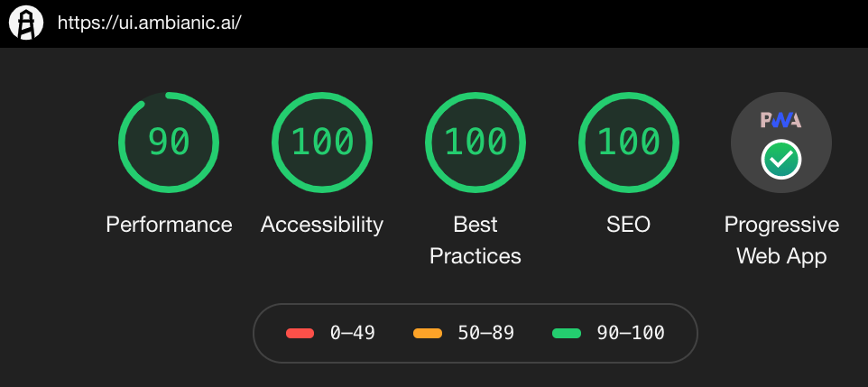
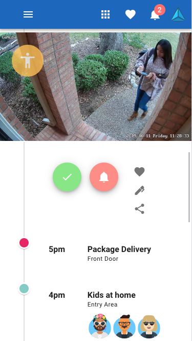
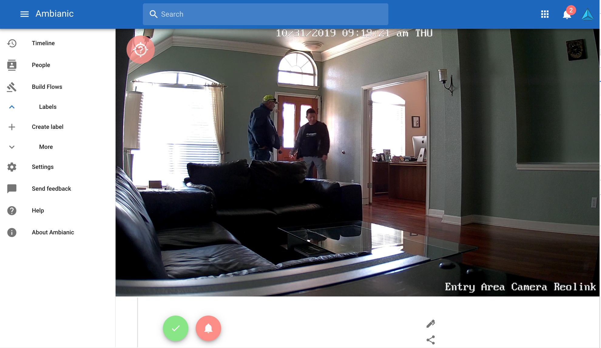

# Ambianic Client UI

[](https://gitpod.io/#https://github.com/ambianic/ambianic-ui)
[](https://join.slack.com/t/ambianicai/shared_invite/zt-eosk4tv5-~GR3Sm7ccGbv1R7IEpk7OQ)

[](https://www.npmjs.com/package/ambianic-ui)

[](https://badge.fury.io/js/ambianic-ui)
[](https://app.netlify.com/sites/happy-franklin-69b6d4/deploys)
[](https://app.fossa.io/projects/git%2Bgithub.com%2Fambianic%2Fambianic-ui?ref=badge_shield) 
[](https://www.codefactor.io/repository/github/ambianic/ambianic-ui)

[](https://codecov.io/gh/ambianic/ambianic-ui)
[](https://github.com/semantic-release/semantic-release)

Ambianic Client UI is an Offline-first Progressive Web App (PWA) to manage Ambianic Edge deployments.




&nbsp;

The app is explicitly designed with user privacy and data ownership in mind:

* Stores data exclusively on user's own client device (desktop or mobile).
* Does not store ANY user information in the cloud.
* User may explicitly chose to store a backup of their data on a server of their choice.
* User data remains 100% owned and controlled by the user at all times.
* No fine print. No obscure opt-in / opt-out pop-ups of any kind.

# Project Status

A hosted version of the app is now available to install here: [https://ui.ambianic.ai/](https://ui.ambianic.ai/)

See the [Quick Start](https://docs.ambianic.ai/users/quickstart/) guide for instructions how to connect Ambianic UI to Ambianic Edge for secure and private data access.

Example screenshots on mobile and desktop:
 


&nbsp;



## Cloud deploymeny

This project is deployed on Netlify by default and is available at https://ui.ambianic.ai . 
If you prefer to launch your own deployment from this repo, click the button below:

[](https://app.netlify.com/start/deploy?repository=https://github.com/ambianic/ambianic-ui)

## Local Installation & Setup

### Clone repository
```
git clone https://github.com/ambianic/ambianic-ui.git
cd ambianic-ui
```

### Install dependencies
```
npm install
```

### Compiles and hot-reloads for development
```
npm run serve
```

### Compiles and minifies for production
```
npm run build
```

### Runs all tests
```
npm run test
```

# Community Support 

If you have questions, ideas or cool projects you'd like to share with the Ambianic team and community, please use the [Ambianic Twitter channel](https://twitter.com/ambianicai).

# Acknowledgements

*  This project's initial version was inspired by
[David Garoro](https://github.com/davidgaroro)'s [PWA example](https://github.com/davidgaroro/vuetify-todo-pwa).
*  The project relies heavily on the awesome [Vue.js](https://vuejs.org/) framework with [Vuetify](https://vuetifyjs.com/en/) material design components.


## License
[](https://app.fossa.io/projects/git%2Bgithub.com%2Fambianic%2Fambianic-ui?ref=badge_large)

 &nbsp; 
<a href="https://landscape.lfai.foundation/format=card-mode&selected=ambianic">
      
</a>
